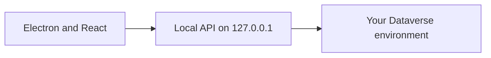

# Power Tools

A modern open-source desktop toolkit for everyday Dataverse, Dynamics 365, and Power Platform work, with a friendly UI, secure local workflow, and tools that are easy to figure out and use. A free, modern XrmToolBox alternative for Windows.

[](https://powertools.abdallahnagy.com/)
[](LICENSE)

**[Download for Windows](https://github.com/AbdallahNagy/PowerTools/releases/latest/download/PowerTools-Setup.exe)** · **[Website](https://powertools.abdallahnagy.com/)** · **[Issues](https://github.com/AbdallahNagy/PowerTools/issues)**

Power Tools is a Windows desktop app for Dataverse and Dynamics 365 developers. Migration, FetchXML, plug-in registration, and related metadata work live in one workspace. The app runs on your machine and connects directly to your environments.

## Tools

| Tool | What you can do |
| --- | --- |
| [Attribute Explorer](desktop/src/ui/tools/attribute-explorer/) | Browse every table in an environment and inspect its fields, types, and lookups. |
| [Bulk Workflow Execution](desktop/src/ui/tools/bulk-workflow-execution/) | Run an on-demand workflow against every record a view or FetchXML query returns, in batches you can pace and stop. |
| [Data Migration](desktop/src/ui/tools/data-migration/) | Move data between Dataverse environments with a guided workflow. |
| [FetchXML Builder](desktop/src/ui/tools/fetchxml-builder/) | Build, run, and refine FetchXML queries. |
| [FetchXML Tester](desktop/src/ui/tools/fetchxml-tester/) | Run FetchXML as written and keep a query library. |
| [Plugin Registration](desktop/src/ui/tools/plugin-registration/) | Browse and manage plug-in assemblies, types, steps, and images. |
| [Polymorphic Lookup Creator](desktop/src/ui/tools/polymorphic-lookup-creator/) | Create, update, and delete polymorphic lookups. |
| [Solution Components Mover](desktop/src/ui/tools/solution-components-mover/) | Copy solution components from selected solutions into unmanaged solutions in the same environment. |
| [Translator](desktop/src/ui/tools/translator/) | Edit display names and descriptions of tables, columns, choices, views, and charts in every installed language. |
| [Workflow Activities Viewer](desktop/src/ui/tools/workflow-activities-viewer/) | See which activated processes reference a custom workflow activity. |

Each tool opens in its own tab. The activity-bar tools can stay open in more than one tab at a time, and each tab keeps its own state.

## Download

The published installer is for Windows.

1. Download [PowerTools-Setup.exe](https://github.com/AbdallahNagy/PowerTools/releases/latest/download/PowerTools-Setup.exe), or start from the [download page](https://powertools.abdallahnagy.com/download).
2. Run the installer on your machine.
3. Open Power Tools and add a connection.
4. The installed app checks for later releases.

### Connections

- **Online.** Enter the environment URL. A browser window opens for Microsoft sign-in. Saved connections come back after a restart.
- **On-premises.** Connect with Active Directory or IFD.

Switch or remove connections from the status bar.

## Your data stays local

Power Tools runs on your machine and connects directly to Dataverse. Your Dataverse data stays on your machine. The [website](https://powertools.abdallahnagy.com/) introduces the app. It does not host or process your Dataverse data.

The interface calls Dataverse through a local ASP.NET Core API bound to `127.0.0.1`. The desktop app starts that API and stops it when the app exits.



## Repository

| Path | What it is |
| --- | --- |
| [`desktop/`](desktop/) | Electron and React client. Windows is the production target. |
| [`api/PowerTools/`](api/PowerTools/) | Local ASP.NET Core API the desktop app starts. |
| [`website/`](website/) | Product website, published to GitHub Pages. |

## Develop

Install [Node.js 24](https://nodejs.org/) and the [.NET 9 SDK](https://dotnet.microsoft.com/download/dotnet/9.0). `npm run dev` starts the React app, Electron, and the local API. The API is launched with `dotnet run`, so `dotnet` has to be on `PATH`.

```bash
cd desktop
npm ci
npm run dev
```

Desktop CI runs this check on Windows:

```bash
cd desktop
npm run check
```

`npm run check` type-checks, lints with zero warnings, runs unit tests, builds the renderer, and runs the Electron smoke test.

API tests:

```bash
dotnet test api/PowerTools/PowerTools.sln
```

Website (the deploy workflow uses pnpm 11.9):

```bash
cd website
pnpm install
pnpm dev
```

Build a Windows installer from source:

```bash
cd desktop
npm run dist:win
```

## Contributing

Issues and pull requests are welcome.

- Report a bug from real Dataverse work.
- Suggest a rough edge in a tool you already use.
- Open an issue before starting a new tool, so the scope is clear.

For desktop changes, run `npm run check` from `desktop/` before opening a pull request. [Desktop CI](.github/workflows/desktop-ci.yml) runs that same check.

## License

[MIT](LICENSE) © Abdallah Nagy

## Contact

Abdallah Nagy — [abdallah@abdallahnagy.com](mailto:abdallah@abdallahnagy.com)

- [GitHub issues](https://github.com/AbdallahNagy/PowerTools/issues)
- [Contact page](https://powertools.abdallahnagy.com/contact)
