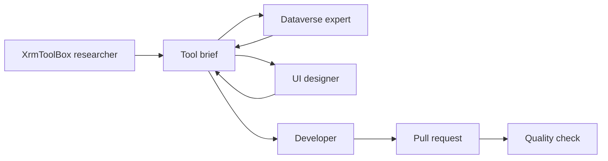

# Tool-building pipeline

New Dataverse tools start with the `xrmtoolbox-plugin-researcher` agent. Cursor does not pass one agent's chat to the next. Handoff is the brief file below. Dataverse review and UX run in parallel after research. The developer starts only when both sections are written.

## Roles

| Order | Agent file | Writes |
| --- | --- | --- |
| 1 | `.cursor/agents/xrmtoolbox-plugin-researcher.md` | Match and backend findings, in the sections that file already specifies |
| 2, in parallel | `.cursor/agents/dataverse-expert.md` | Dataverse review |
| 2, in parallel | `.cursor/agents/power-tools-ux.md` | UX |
| 3, after both sections exist | `.cursor/agents/power-tools-developer.md` | Implementation notes, test evidence, and a draft pull request |
| 4 | `.cursor/agents/power-tools-reviewer.md` | Short pass or fail on the pull request |

Save the researcher's brief unchanged as the start of the handoff file before Dataverse review or UX begins. Do not edit `.cursor/agents/xrmtoolbox-plugin-researcher.md` to change that output.

Stop and ask the user only for an ambiguous tool name, a GPL or other copyleft license, or two real product scopes. Mark ordinary uncertainty in the owning section instead of opening a question.

## Brief file

One file per tool:

`desktop/docs/tools/<tool-id>/brief.md`

`<tool-id>` is the kebab-case id from the researcher's Power Tools mapping.

Each role appends its own section and does not rewrite earlier sections. Parallel roles append only their own heading. If that heading is already present, stop.

The file starts with the researcher's sections, copied as written:

- `### Match`
- `### What it does`
- `### Backend findings`
- `### Power Tools mapping`
- `### Recommended implementation`

Later roles append, in this order when both parallel sections are present:

### Dataverse review

Corrections, privileges, and limits. Include online versus on-premises behavior, solution and managed limits, failure modes, and anything the XrmToolBox plugin got wrong or left unverified.

### UX

Screens, empty and error states, and what not to build. This section is written from the capability list in `### What it does` only.

### Implementation notes and test evidence

What the developer changed, which checks ran, and the results.

### Open questions

Only decisions the user must make. Write `None.` when there are none. Do not delete questions an earlier role already appended.

## Developer gate

`power-tools-developer` does not implement, branch, or open a pull request until `desktop/docs/tools/<tool-id>/brief.md` contains both `### Dataverse review` and `### UX`, and each of those sections has at least one sentence or list item. Missing either section means the brief is not ready.
